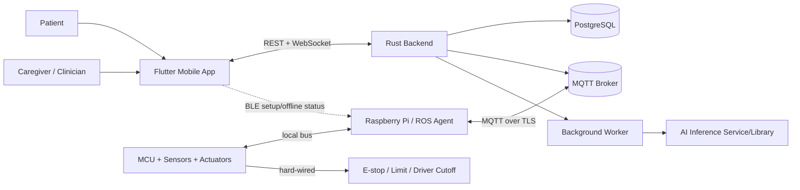
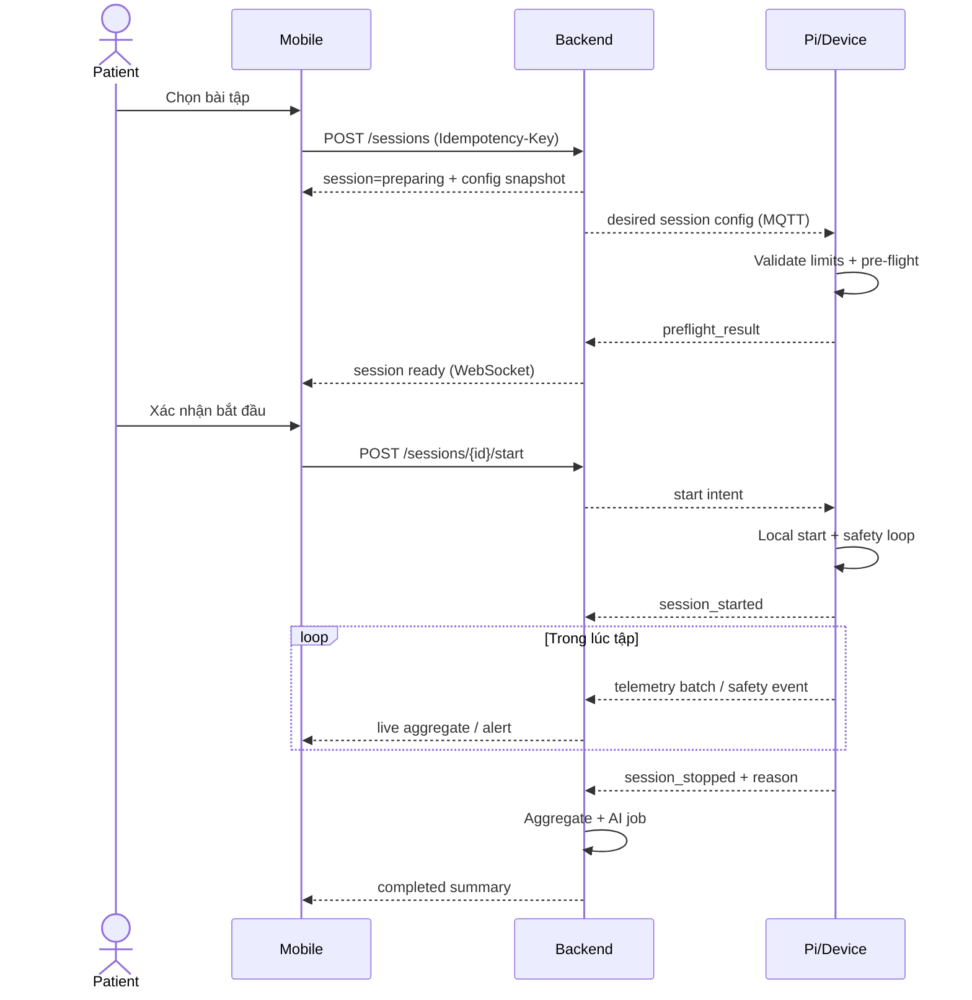

# 02. Kiến trúc hệ thống

## 1. Sơ đồ ngữ cảnh



## 2. Quyết định kiến trúc

| Mã | Quyết định | Lý do |
|---|---|---|
| ADR-001 | Safety/control loop ở MCU/Pi, không ở backend | Mất mạng hoặc backend chậm không được ảnh hưởng an toàn |
| ADR-002 | REST cho nghiệp vụ, MQTT cho device telemetry, WebSocket cho app realtime | Tách rõ workload và mô hình kết nối |
| ADR-003 | Modular monolith Rust trong MVP | Đơn giản vận hành nhưng vẫn có boundary để tách service sau này |
| ADR-004 | PostgreSQL là source of truth | Transaction, constraint và truy vấn báo cáo tốt |
| ADR-005 | Telemetry lưu theo batch/time-series partition | Giảm overhead mỗi sample và quản lý retention |
| ADR-006 | API/protocol versioned và idempotent | Hỗ trợ offline/retry và firmware/app khác phiên bản |
| ADR-007 | AI async cho báo cáo; rule engine local cho safety | AI không nằm trên đường critical |

## 3. Thành phần và trách nhiệm

### 3.1 MCU/firmware

- Lấy mẫu IMU, encoder, current sensor, limit switch, heart-rate (nếu có).
- Điều khiển motor trong giới hạn hard/soft đã được ký duyệt.
- Debounce e-stop/limit, watchdog, current cutoff và safe-state.
- Timestamp/sequence sample; giao tiếp với Pi qua serial/CAN/UART theo phần cứng.
- Không nhận lệnh torque/speed tùy ý từ cloud.

### 3.2 Raspberry Pi / ROS agent

- Adapter phần cứng, sensor fusion nhẹ, local session coordinator.
- Lưu buffer bền vững, batch/compress telemetry và upload.
- Nhận `desired_config`, kiểm tra chữ ký/version/range rồi chuyển cấu hình hợp lệ xuống MCU.
- Publish device health, event và acknowledgement.
- Hỗ trợ BLE cho provisioning/diagnostic tối thiểu.

### 3.3 Rust backend

- Xác thực, phân quyền và quản lý quan hệ chia sẻ.
- Quản lý device, exercise, plan, session và alert.
- Ingest telemetry; đảm bảo idempotency/ordering; tổng hợp tiến độ.
- Phát realtime state tới ứng dụng.
- Điều phối notification và AI job.
- Không phát command actuator trực tiếp.

### 3.4 Flutter mobile app

- Giao diện người tập/người chăm sóc theo role.
- Pre-flight, hướng dẫn bài, quan sát realtime và kết quả.
- BLE provisioning; cache dữ liệu đọc gần nhất.
- Không giả định UI warning đã thay thế cảnh báo vật lý.

### 3.5 AI pipeline

- Feature extraction theo cửa sổ có version.
- Inference và lưu assessment; báo `uncertain` nếu ngoài phân phối/confidence thấp.
- Training dataset tách khỏi production DB, có consent và de-identification.
- Model registry lưu version, metrics, data lineage và trạng thái phê duyệt.

## 4. Luồng bắt đầu và kết thúc buổi tập



`start intent` chỉ đề nghị thiết bị chạy cấu hình đã duyệt. Thiết bị có quyền từ chối ở mọi thời điểm.

## 5. Luồng emergency

1. Người dùng nhấn e-stop hoặc phần cứng phát hiện critical fault.
2. MCU ngắt/giảm hỗ trợ theo safe-state đã kiểm thử; không đợi Pi/backend.
3. Pi ghi local event với timestamp, sensor snapshot và sequence.
4. Pi phát còi/rung/voice tại chỗ, gửi event lên broker nếu có mạng.
5. Backend đánh dấu session `aborted`, tạo alert `critical`, gửi notification.
6. Mobile hiển thị hướng dẫn an toàn và nút gọi liên hệ; không có nút “bỏ qua và tiếp tục”.
7. Reset e-stop yêu cầu thao tác vật lý và chạy lại pre-flight.

## 6. Deployment MVP

```text
Internet
  ├─ HTTPS/WSS Load Balancer
  │    └─ Rust API (stateless, 1..n instances)
  ├─ MQTT Broker (TLS, device certificate)
  ├─ Worker (aggregation, notification, AI)
  ├─ PostgreSQL
  └─ Object storage (model artifact/export; optional in phase 1)

Home/Clinic
  ├─ Mobile App
  └─ Exoskeleton
       ├─ Raspberry Pi / ROS Agent
       └─ MCU + actuator + hard safety circuit
```

MVP có thể chạy API và worker trong cùng binary/process profile, nhưng domain/application boundary không thay đổi.

## 7. Availability và degraded modes

| Sự cố | Hành vi bắt buộc |
|---|---|
| Mất Internet | Session đang chạy tiếp tục local nếu an toàn; buffer dữ liệu; app báo offline |
| Backend lỗi | Không ảnh hưởng safety loop; không bắt đầu session cloud mới nếu chưa có config hợp lệ |
| MQTT đứt | Pi reconnect exponential backoff; không mất sequence |
| Mobile đóng | Thiết bị vẫn kết thúc an toàn; summary đồng bộ sau |
| Sensor critical lỗi | Không bắt đầu hoặc abort session; ghi fault |
| AI lỗi | Session vẫn hoàn thành; assessment ở trạng thái `pending/failed`, không chặn summary cơ bản |
| Notification provider lỗi | Retry có giới hạn + dead-letter; emergency local vẫn hoạt động |

## 8. Mục tiêu phi chức năng ban đầu

- Local safety reaction: xác định bằng hazard analysis và đo trên phần cứng; không dùng SLA cloud thay thế.
- API p95 cho CRUD: dưới 300 ms trong tải pilot, không tính mạng di động.
- Live aggregate app: mục tiêu 2–5 updates/giây; raw sensor không cần đẩy toàn bộ tới app.
- Telemetry ingest: chấp nhận retry/duplicate, không mất batch đã acknowledge.
- Backend availability pilot: 99.5%; backup database hằng ngày và point-in-time recovery khi production.
- Audit thay đổi plan/config và truy cập dữ liệu nhạy cảm.

