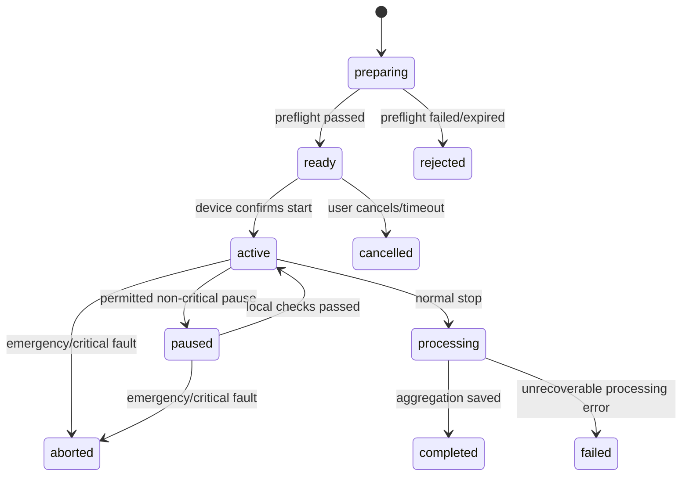

# 03. Domain và module

## 1. Nguyên tắc chia module

- Chia theo năng lực nghiệp vụ, không chia theo loại file toàn hệ thống.
- Mỗi module sở hữu entity, rule, use case và repository port của nó.
- Module khác chỉ gọi public application interface/event, không truy cập table/repository nội bộ tùy ý.
- Safety event và raw telemetry là dữ liệu bất biến; sửa sai bằng event/record bổ sung.

## 2. Bản đồ module

| Module | Trách nhiệm | Aggregate/entity chính | Không chịu trách nhiệm |
|---|---|---|---|
| `identity` | Account, credential, token, role | `User`, `RefreshSession` | Hồ sơ phục hồi chi tiết |
| `profiles` | Patient profile, caregiver link, clinician assignment, consent | `PatientProfile`, `CareRelationship`, `Consent` | Authentication |
| `devices` | Registry, pairing, capability, calibration, desired/reported config | `Device`, `DevicePairing`, `Calibration` | Raw training telemetry |
| `exercises` | Catalog và version bài tập | `Exercise`, `ExerciseVersion` | Gán lịch cho patient |
| `plans` | Chương trình tập cá nhân, item, target | `TrainingPlan`, `PlanItem` | Thực thi session |
| `sessions` | Vòng đời buổi tập và config snapshot | `TrainingSession`, `SessionSummary` | Driver motor |
| `telemetry` | Ingest batch, sample, dedup, retention | `TelemetryBatch`, `TelemetrySample` | Sửa plan/session |
| `safety` | Alert, emergency/fault event, acknowledgement | `SafetyEvent`, `Alert` | Điều khiển safe-state vật lý |
| `assessments` | Feature, AI output, rule assessment, model registry | `Assessment`, `ModelVersion` | Chẩn đoán y khoa |
| `progress` | Daily/weekly aggregation và report | `ProgressSnapshot` | Dữ liệu gốc |
| `notifications` | Push/in-app delivery và preference | `Notification`, `DeliveryAttempt` | Quyết định severity |
| `audit` | Nhật ký hành động nhạy cảm | `AuditEntry` | Business analytics |

## 3. Module contract

### 3.1 `identity`

Use cases:

- `RegisterUser`, `Login`, `RefreshToken`, `Logout`, `RequestPasswordReset`, `ResetPassword`.
- `AssignRole` chỉ dành cho admin; patient không tự nâng quyền.

Invariant:

- Email được normalize lowercase/trim và unique.
- Password hash bằng Argon2id; không log credential/token.
- Refresh token rotation; revoke toàn bộ token khi credential bị reset.

Events: `UserRegistered`, `UserRoleChanged`, `UserDeactivated`.

### 3.2 `profiles`

Use cases:

- Cập nhật hồ sơ cơ bản, emergency contact.
- Gửi/chấp nhận/thu hồi liên kết caregiver.
- Clinician assignment do tổ chức/admin hoặc workflow được duyệt tạo.
- Ghi nhận consent version và thời điểm thu hồi.

Invariant:

- Người xem patient data phải là chính patient hoặc có relationship `active` với scope phù hợp.
- Thu hồi quyền ảnh hưởng request tiếp theo; token không chứa danh sách patient cố định dài hạn.

Events: `CareRelationshipActivated`, `CareRelationshipRevoked`, `ConsentChanged`.

### 3.3 `devices`

Use cases:

- Đăng ký device factory/admin; tạo pairing code TTL ngắn.
- Claim/revoke device; cập nhật reported state; quản lý calibration.
- Đề nghị config version mới trong capability/range cho phép.

Invariant:

- Một device chỉ có tối đa một patient owner active ở MVP.
- Pairing code one-time, hashed khi lưu và hết hạn.
- Desired config không được vượt device capability/hard limit.
- Device chỉ báo `ready` khi required sensors, e-stop, calibration và firmware compatibility đều hợp lệ.

Events: `DevicePaired`, `DeviceUnpaired`, `DeviceHealthChanged`, `CalibrationCompleted`, `DeviceConfigAcknowledged`.

### 3.4 `exercises`

Exercise là định danh logic; `ExerciseVersion` là nội dung bất biến đã publish.

Các loại MVP:

- `seated_posture_hold`
- `standing_balance`
- `sit_to_stand`
- `knee_flexion_extension`
- `controlled_forward_bend`
- `lateral_lean`
- `slow_level_walk`

Một version chứa hướng dẫn, required capabilities, target kiểu repetition/duration, range schema, stop conditions và asset voice/illustration. Draft có thể sửa; published version không sửa.

### 3.5 `plans`

Use cases: tạo draft, thêm item, publish, assign, pause, complete.

Invariant:

- Chỉ clinician có quan hệ hợp lệ hoặc patient với template self-guided mới tạo/đổi plan.
- Item tham chiếu `exercise_version_id`, có target và safe configuration được validate.
- Publish tạo version; chỉnh plan đã publish tạo revision mới.

Events: `PlanPublished`, `PlanAssigned`, `PlanPaused`.

### 3.6 `sessions`

State machine:



Invariant:

- Device xác nhận chuyển `ready -> active`; API request một mình không đủ.
- `aborted` không thể resume; muốn tập lại tạo session mới.
- Snapshot gồm exercise/plan revision, thresholds, assistance level, calibration và model/rule version.
- Summary có thể tái tính toán theo version mới nhưng không ghi đè bản gốc; tạo revision.

Events: `SessionPrepared`, `SessionStarted`, `SessionStopped`, `SessionAborted`, `SessionCompleted`.

### 3.7 `telemetry`

- Nhận batch theo `(device_id, boot_id, sequence_start, sequence_end)`.
- Validate schema/range/time drift; lưu raw batch/sample hợp lệ và quarantine batch lỗi.
- Duplicate trả kết quả idempotent; gap tạo diagnostic event, không tự bịa sample.
- Sample không chứa tên/email; liên kết session/device bằng UUID.

Events: `TelemetryBatchAccepted`, `TelemetryGapDetected`, `TelemetryBatchQuarantined`.

### 3.8 `safety`

Severity:

| Severity | Ví dụ | Hành vi |
|---|---|---|
| `info` | Chưa đủ ROM | Nhắc nhẹ, ghi session |
| `warning` | Sai tư thế kéo dài, nhịp quá nhanh | Rung/voice, app banner |
| `critical` | E-stop, overcurrent, hard limit, sensor critical fault | Local safe-state, abort session, notification ưu tiên |

Lifecycle alert: `open -> acknowledged -> resolved`; critical alert không được xóa, chỉ resolve với actor/reason.

### 3.9 `assessments`

- `rule` và `ml` là hai source riêng.
- Kết quả cần `label`, `confidence` (nếu ML), time range, version và explanation codes.
- ML output không hạ severity do rule/safety tạo ra.
- Reprocessing tạo assessment mới với `supersedes_id`.

### 3.10 `progress`

Tổng hợp theo timezone của patient nhưng lưu range UTC. Các metric chuẩn:

- `session_count`, `completed_session_count`, `active_seconds`
- `planned_repetitions`, `completed_repetitions`
- `correctness_ratio`, `warning_count`, `critical_count`
- `hip_rom_left/right`, `knee_rom_left/right`
- `average_tempo`, `adherence_ratio`

Không gộp hai loại bài tập khác nhau thành một ROM target nếu không có định nghĩa metric chung.

## 4. Domain event và side effect

Domain event được ghi cùng transaction nghiệp vụ vào `outbox_events`. Worker publish/xử lý idempotent.

| Event | Consumer |
|---|---|
| `SessionStarted` | Realtime gateway, audit |
| `TelemetryBatchAccepted` | Aggregator, AI feature pipeline |
| `SessionAborted` | Notification, progress, audit |
| `SessionCompleted` | Progress, notification, AI |
| `CareRelationshipRevoked` | Authorization cache invalidation, audit |
| `DeviceHealthChanged` | Realtime, notification khi critical |

## 5. Dependency giữa module

Hướng dependency nghiệp vụ chính:

```text
plans ──> profiles, exercises
sessions ──> profiles, devices, plans/exercises
telemetry ──> sessions, devices
safety ──> sessions, devices
assessments ──> sessions, telemetry
progress ──> sessions, assessments, safety
notifications ──> domain events
audit ──> domain/application events
```

Mũi tên là phụ thuộc contract/application query, không cho phép import infrastructure của module khác.

