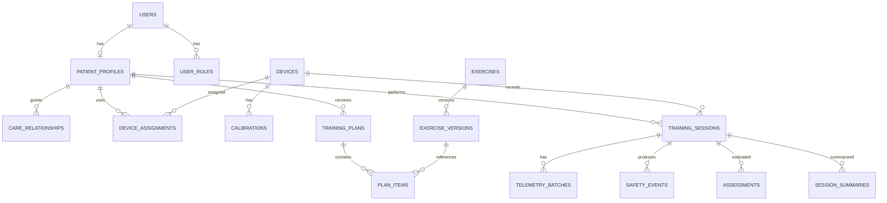

# 05. Mô hình dữ liệu

## 1. Quy ước

- PostgreSQL là source of truth. Primary key `uuid`; nội bộ có thể bổ sung bigint/time key cho telemetry partition.
- Mọi bảng mutable có `created_at`, `updated_at`, `version`; thời gian là `timestamptz` UTC.
- Enum nghiệp vụ được kiểm soát bằng PostgreSQL enum hoặc `text + check` tùy chiến lược migration.
- Dữ liệu nhạy cảm được phân loại; log không chứa PII hoặc raw token.
- JSONB chỉ dùng cho payload có version/cấu trúc biến đổi, không thay thế cột cần query/constraint.

## 2. Quan hệ chính

## 3. Identity và hồ sơ

### `users`

| Cột | Kiểu | Ghi chú |
|---|---|---|
| `id` | uuid PK | |
| `email_normalized` | citext/text unique | Không trả cho actor không có quyền |
| `password_hash` | text | Argon2id |
| `display_name` | text | |
| `status` | text | `active`, `locked`, `deactivated` |
| `locale` | text | mặc định `vi` |
| `timezone` | text | IANA timezone |
| timestamps/version | | |

`user_roles(user_id, role, created_at)` unique `(user_id, role)`.

`refresh_sessions(id, user_id, token_hash, device_label, expires_at, rotated_from_id, revoked_at, last_used_at)`; index token hash và active sessions theo user.

### `patient_profiles`

`id`, `user_id` unique, `date_of_birth`, `height_cm`, `weight_kg`, `mobility_level`, `emergency_contact_encrypted`, `clinical_notes_encrypted` (chỉ nếu thật sự cần), timestamps/version.

Không lưu chẩn đoán tự do trong MVP nếu chưa có policy và nhu cầu rõ ràng.

### `care_relationships`

`id`, `patient_id`, `related_user_id`, `relationship_type` (`caregiver|clinician`), `scopes[]`, `status` (`pending|active|revoked|expired`), `invited_by`, `accepted_at`, `revoked_at`, timestamps/version.

Unique partial index ngăn nhiều quan hệ active trùng cặp.

### `consents`

`id`, `patient_id`, `consent_type`, `document_version`, `status`, `granted_at`, `withdrawn_at`, `evidence_json`, timestamps. Consent là append-oriented; không overwrite lịch sử.

## 4. Device

### `devices`

| Cột | Ý nghĩa |
|---|---|
| `id`, `serial_number` unique | Định danh |
| `model`, `hardware_revision` | Compatibility |
| `firmware_version`, `agent_version`, `protocol_version` | Version đang report |
| `status` | `provisioned`, `paired`, `maintenance`, `revoked` |
| `capabilities_json` | Sensor/actuator side, sample rate/range hỗ trợ; có schema version |
| `last_seen_at` | Health |
| `credential_fingerprint` | Không lưu private key |

### Bảng liên quan

- `device_assignments(id, device_id, patient_id, status, assigned_at, unassigned_at)`.
- `device_pairing_codes(id, device_id, code_hash, expires_at, consumed_at, attempts)`.
- `device_reported_states(device_id, observed_at, online, battery_percent, sensor_health_json, motor_health_json, active_session_id, config_version)`.
- `device_configs(id, device_id, version, desired_json, status, requested_by, requested_at, acknowledged_at, reject_reason)`.
- `calibrations(id, device_id, patient_id, type, version, result_json, performed_at, expires_at, status)`.

`device_reported_states` có thể giữ current row + history rút gọn tùy vận hành; fault quan trọng luôn đi vào safety event.

## 5. Exercise và plan

### `exercises`

`id`, `code` unique, `name_key`, `category`, `status`, timestamps.

### `exercise_versions`

`id`, `exercise_id`, `version`, `instructions_json`, `required_capabilities_json`, `target_schema_json`, `allowed_config_schema_json`, `stop_conditions_json`, `published_at`, `published_by`. Unique `(exercise_id, version)`. Published row bất biến.

### `training_plans`

`id`, `patient_id`, `name`, `revision`, `status` (`draft|active|paused|completed|archived`), `valid_from`, `valid_to`, `created_by`, `published_at`, timestamps/version.

### `plan_items`

`id`, `plan_id`, `exercise_version_id`, `order_index`, `schedule_json`, `target_json`, `safe_config_json`, `notes`, timestamps. Unique `(plan_id, order_index)`.

## 6. Session và kết quả

### `training_sessions`

| Cột | Kiểu/nội dung |
|---|---|
| `id` | uuid PK |
| `patient_id`, `device_id` | FK |
| `plan_id`, `plan_item_id` | nullable cho self-guided hợp lệ |
| `exercise_version_id` | snapshot reference |
| `status` | `preparing|ready|active|paused|processing|completed|cancelled|rejected|aborted|failed` |
| `config_snapshot_json` | Plan target, limit, assistance, calibration/model/rule version |
| `prepared_at`, `started_at`, `ended_at` | timestamps |
| `end_reason` | enum/code ổn định |
| `device_boot_id` | truy vết sequence |
| `idempotency_key_hash` | unique theo actor/operation |
| timestamps/version | |

Unique partial index: một session `active|paused` trên mỗi device.

### `session_summaries`

`id`, `session_id`, `revision`, `algorithm_version`, `duration_seconds`, `completed_repetitions`, `correct_repetitions`, `correctness_ratio`, ROM left/right, tempo, heart-rate aggregates (nếu consent), `warning_count`, `critical_count`, `quality_flags[]`, `generated_at`, `supersedes_id`.

Không tính `correctness_ratio` khi denominator bằng 0; trả `null` kèm quality flag.

## 7. Telemetry

### `telemetry_batches`

`id`, `device_id`, `session_id`, `boot_id`, `sequence_start`, `sequence_end`, `sample_rate_hz`, `schema_version`, `device_started_at`, `received_at`, `payload_checksum`, `storage_ref/raw_payload`, `status`, `quality_flags[]`.

Unique `(device_id, boot_id, sequence_start, sequence_end)` và/hoặc checksum để dedup.

### `telemetry_samples` (khi cần query sample)

Partition theo `recorded_at` (ngày/tuần tùy tải):

- identity: `device_id`, `session_id`, `boot_id`, `sequence`, `recorded_at`
- IMU: `trunk_pitch_deg`, `trunk_roll_deg`, accel/gyro axes
- joint: `hip_left_deg`, `hip_right_deg`, `knee_left_deg`, `knee_right_deg`
- derivative: joint speed nếu gửi từ device; backend có thể tái tính với algorithm version
- system: `motor_current_left_ma/right_ma`, limit flags, e-stop, battery, heart-rate nullable
- quality: `sensor_validity_mask`, `calibration_version`

Không bắt buộc normalize mỗi sensor thành một row trong MVP vì write amplification lớn. Raw batch có thể nằm object storage/bytea nén và summary/index cần thiết nằm PostgreSQL; quyết định cuối dựa trên benchmark.

## 8. Safety, assessment, notification, audit

### `safety_events`

`id`, `session_id`, `device_id`, `patient_id`, `event_type`, `severity`, `source` (`hardware|firmware|rule|ml|user`), `occurred_at`, `received_at`, `sequence`, `snapshot_json`, `local_action`, `acknowledged_by/at`, `resolved_by/at`, `resolution_note`.

### `assessments`

`id`, `session_id`, `source`, `label`, `confidence`, `window_start/end`, `model_version_id`, `rule_version`, `explanation_codes[]`, `features_ref`, `created_at`, `supersedes_id`.

### `model_versions`

`id`, `name`, `version`, `status` (`candidate|approved|retired`), `artifact_uri`, `artifact_hash`, `feature_schema_version`, `metrics_json`, `approved_by/at`, `created_at`.

### `notifications`

`id`, `recipient_user_id`, `type`, `severity`, `title_key`, `body_params_json`, `related_resource_type/id`, `status`, `read_at`, timestamps. Delivery attempts ở bảng riêng, không chứa raw provider token trong log.

### `audit_entries`

`id`, `actor_type/id`, `action`, `resource_type/id`, `patient_id`, `occurred_at`, `request_id`, `ip_hash`, `user_agent`, `before_hash`, `after_hash`, `metadata_json`. Append-only và quyền đọc hạn chế.

## 9. Index tối thiểu

- `users(email_normalized)` unique.
- `care_relationships(related_user_id, status)` và `(patient_id, status)`.
- `device_assignments(patient_id, status)`, `devices(serial_number)`.
- `training_sessions(patient_id, started_at desc)`, `(device_id, status)`, `(status, updated_at)`.
- `telemetry_batches(session_id, sequence_start)`, unique dedup key.
- `telemetry_samples(session_id, recorded_at)` trên từng partition.
- `safety_events(patient_id, occurred_at desc)`, `(session_id, occurred_at)`.
- `notifications(recipient_user_id, read_at, created_at desc)`.
- `outbox_events(status, available_at)`.

Mọi index bổ sung dựa trên `EXPLAIN ANALYZE` của query thật; tránh index tất cả cột telemetry.

## 10. Retention và xóa

Giá trị cuối cần legal/product phê duyệt. Baseline đề xuất để thảo luận:

| Dữ liệu | Baseline |
|---|---|
| Raw high-frequency telemetry | 90 ngày, sau đó xóa/ẩn danh hoặc archive có consent |
| Session summary/progress | Đến khi user yêu cầu xóa hoặc policy hết hạn |
| Safety event | Lâu hơn raw telemetry theo safety/legal policy |
| Auth/security log | 90–180 ngày |
| Audit nhạy cảm | Theo yêu cầu pháp lý/contract |
| Pairing code | Xóa nhanh sau consumed/expired |

Deletion job phải idempotent, có audit, bảo toàn referential integrity và xóa object storage cùng database index.

